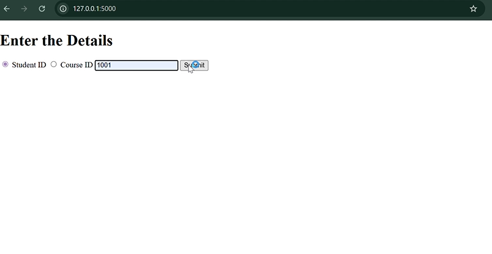
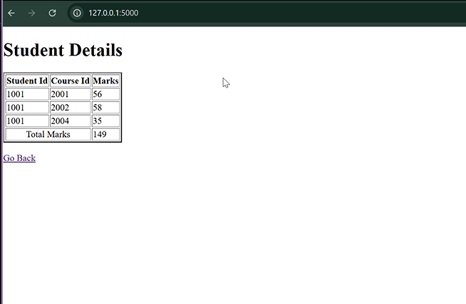
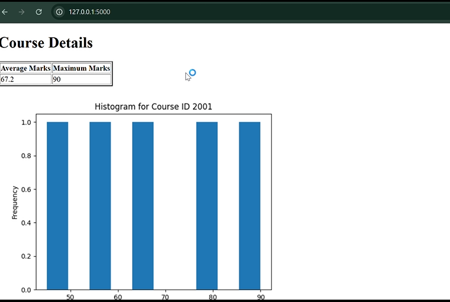
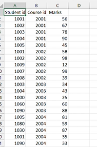

# Student Marks Analysis Tool

A simple Python project that reads student and course marks from CSV files and provides performance analysis.

## 🔧 Features
- Reads student and course data using file handling (no external libraries)
- Shows individual student marks and overall average (by student ID)
- Analyzes course-level performance (average, max marks)
- Visualizes course comparison using Matplotlib

## 🖼️ Screenshots





## 💻 Tech Stack
- Python
- HTML(jinja template)
- flask 
- CSV File Handling
- Matplotlib

## 🚀 Run the Script
```bash
python main.py

